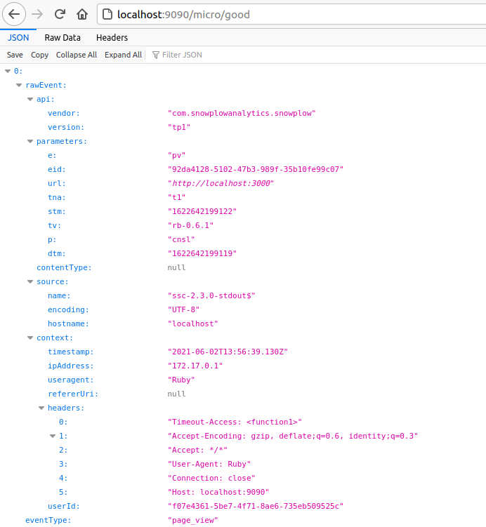

# Tracked blog app with Snowplow Micro
This app was created as the technical test for an application to Snowplow Analytics. It takes a simple blog app, and uses Snowplow Micro to track behavioural data for the app.

## Project Set-up
### Snowplow Micro
Snowplow Micro was set up using the instructions at [Snowplow Micro](https://github.com/snowplow-incubator/snowplow-micro/).

### Blog 
I created a blog app using Ruby on Rails, tested using Rspec and Capybara, with a PostgreSQL database.

### Tracker
I used the Ruby tracker from the [Snowplow Analytics tracker library](https://docs.snowplowanalytics.com/docs/setup-snowplow-on-aws/setup-trackers/).

## Quick Start

1. Clone this repo
2. cd into the new folder
3. run `bundle install`
4. create the development and test databases in postgresql (blog_development and blog_test, respectively)
5. run `rails db:migrate` to run migrations on database
6. run `rails server` to start the rails server
7. in a separate terminal run `docker run --mount type=bind,source=$(pwd)/example,destination=/config -p 9090:9090 snowplow/snowplow-micro:1.1.2 --collector-config /config/micro.conf --iglu /config/iglu.json` to start Snowplow Micro using docker

## Extensions to Project
With more time I would have fixed the test to delete an article, and added the ability for users to comment on articles. 

I would also be interested to expand the use of trackers, in order to see which articles were the most popular.

Lastly, I would add some basic styling to the app.

## Snowplow Micro screenshot

